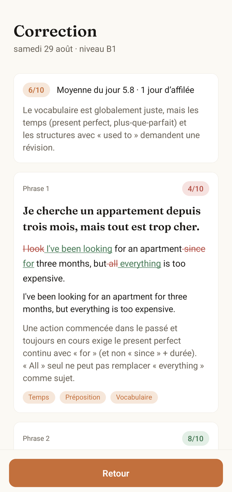
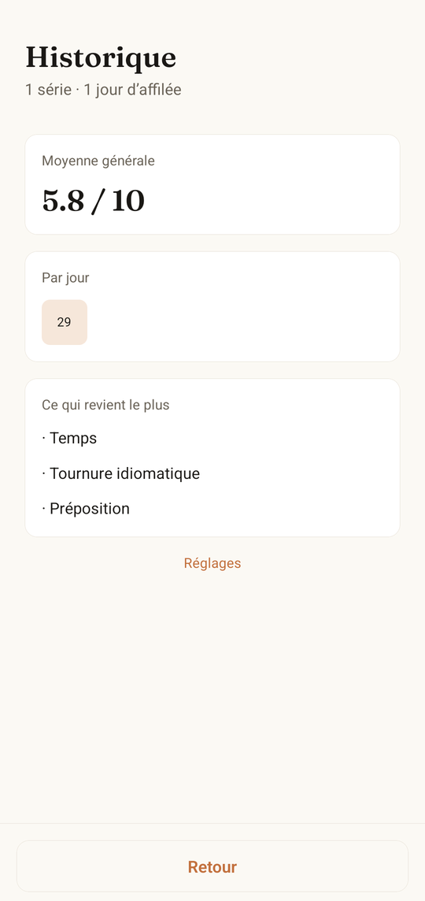
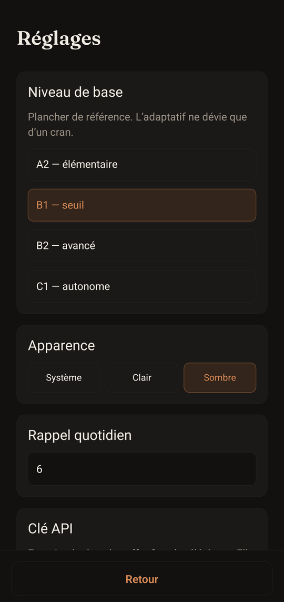

<div align="center">


# Passage

**Cinq phrases à traduire chaque jour. Une correction qui explique.**

Une application mobile d'entraînement à la version française → anglais.
Claude écrit les phrases, corrige les réponses, et le niveau suit ce qu'on rate.

<br>


</div>

<div align="center">

| Aujourd'hui | Correction | Historique | Réglages |
|:---:|:---:|:---:|:---:|
|  |  |  |  |

<sub>Captures réelles, sur appareil. Thème clair et sombre, ou celui du système.</sub>

</div>

---

## Le rituel

Chaque matin, cinq phrases françaises attendent. On les traduit, on valide, et
la correction arrive d'un bloc : une note sur dix par phrase, un diff mot à mot
entre ce qu'on a écrit et ce qu'il fallait écrire, et deux lignes qui expliquent
la règle ratée — pas seulement la bonne réponse.

Ce qu'on rate revient. Les fautes des trois dernières séries sont comptées, et
les deux phrases suivantes ciblent les plus fréquentes ; les trois autres
balaient large, pour ne pas s'enfermer.

## Ce qui rend l'app utilisable au quotidien

**Le niveau s'ajuste, sans dériver.** On choisit un plancher (A2 → C1) dans les
réglages. L'adaptatif monte ou descend d'un cran selon la moyenne des cinq
dernières séries — jamais plus. Le réglage reste la référence.

**Ça marche dans le métro.** La série du lendemain est préchargée dès que celle
du jour est corrigée. La phase de traduction ne demande aucun réseau ; seule la
correction en a besoin. Et si le réseau manque au moment de valider, les
réponses sont gardées et la correction reprend toute seule.

**Rien ne se perd.** Chaque champ s'enregistre pendant la frappe. Quitter
l'écran, tuer l'application, passer minuit en pleine saisie : la série soumise
reste la bonne et les réponses survivent.

**Deux appels par jour.** Un pour écrire les cinq phrases, un pour corriger les
cinq réponses ensemble — corriger phrase par phrase donnerait du vocabulaire
pour les suivantes et fausserait l'évaluation.

**Une fois la série faite, elle est faite.** L'écran du jour affiche la moyenne
et propose de relire la correction ; les phrases suivantes arrivent demain.

## Comment c'est fait

Six couches, dépendances descendantes, chacune testable sans celle du dessus.

| Dossier | Rôle |
|---|---|
| `app/` | routes `expo-router` : les cinq écrans |
| `src/ui/` | thème, composants partagés, fournisseur applicatif |
| `src/usecases/` | cas d'usage : série du jour, correction, prefetch, reprise |
| `src/ai/` | client Claude, prompts, schémas, type d'erreur fermé |
| `src/data/` | SQLite : schéma, migrations, dépôts |
| `src/core/` | logique pure : niveaux, diff, étiquettes, notes, série de jours |

Quelques partis pris qui expliquent le reste :

- **Le diff est calculé localement**, pas demandé au modèle. Plus longue
  sous-séquence commune sur les jetons : déterministe, testable, gratuit en
  tokens.
- **Les sorties du modèle sont validées** par Zod, unicité des positions
  comprise. Une réponse hors contrat est retentée une fois, puis abandonnée
  proprement — la série n'est jamais marquée corrigée à moitié.
- **Aucun effacement ne dépend d'une cascade SQL.** Les suppressions sont
  explicites : « tout effacer » efface vraiment tout, même si le pragma
  `foreign_keys` venait à sauter.
- **Les cas d'usage vivent dans `src/usecases/`**, pas `src/app/` : `expo-router`
  réclame `src/app` comme racine de routes et n'aurait chargé aucun écran.

Modèle : `claude-opus-5`, pensée adaptative, effort `low` pour la génération et
`high` pour la correction.

## La clé API

Saisie dans l'application, rangée dans le coffre-fort du téléphone (Keychain sur
iOS, Keystore sur Android) via `expo-secure-store`. Jamais écrite en base,
jamais journalisée, jamais recopiée dans un message d'erreur.

> [!WARNING]
> **Cette application n'est pas distribuable en l'état.** Un binaire distribué
> se décompile, et n'importe qui pourrait en extraire la clé. Pour la partager,
> il faudrait un proxy côté serveur qui garde la clé et expose les deux appels.

## Lancer

```bash
npm install
npx expo start
```

Au premier lancement : clé API Anthropic, niveau de base, heure de rappel.

### Installer sur un téléphone

Expo Go suffit pour essayer, mais pas pour le rappel quotidien —
`expo-notifications` n'y a plus de module natif depuis le SDK 53. Pour une vraie
application installée :

```bash
export JAVA_HOME=/usr/lib/jvm/java-17-openjdk-amd64   # Gradle refuse le JDK 25
npx expo run:android --variant release
```

`expo prebuild` génère `android/` (ignoré par git, régénérable). Le premier
build prend une vingtaine de minutes : il compile les quatre architectures alors
qu'un téléphone récent n'en utilise qu'une. Pour diviser le temps par quatre,
après le premier prebuild :

```properties
# android/gradle.properties
reactNativeArchitectures=arm64-v8a
```

Paquet installé : `com.passage.app`.

## Tests

```bash
npm test          # 251 tests, deux projets (logique + écrans)
npm run test:node # logique, persistance, IA, cas d'usage
npm run test:tz   # le noyau sous un fuseau qui bascule à minuit
npm run typecheck
npm run lint
npm run deadcode  # exports, fichiers et dépendances jamais atteints
```

Aucun test de la suite n'appelle l'API. Pour éprouver les vrais prompts sur le
vrai client — cela coûte de l'argent :

```bash
ANTHROPIC_API_KEY=sk-ant-… npm run smoke
```

## Icônes

Le dessin vit dans `tools/logo.mjs`, seule source ; `assets/logo.svg` et tous les
PNG en sont dérivés.

```bash
npm run icons
```

`src/ui/Logo.tsx` en tient une copie pour le rendu à l'écran, et un test échoue
si les deux divergent.

## Documents

- **Conception** — `docs/superpowers/specs/2026-08-29-passage-design.md`
- **Plan de mise en œuvre** — `docs/superpowers/plans/2026-08-29-passage.md`
  (instantané historique, conservé tel quel ; l'état courant fait foi)

---

<div align="center">
<sub>Projet personnel. Données locales, aucun compte, aucun serveur.</sub>
</div>
